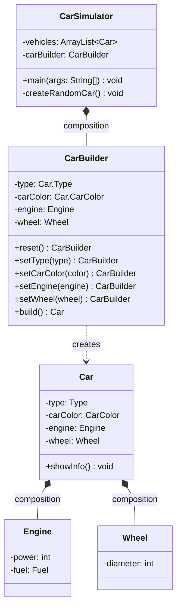

## UML Diagram

```mermaid
classDiagram
    class CarSimulator {
        -vehicles: ArrayList~Car~
        -carBuilder: CarBuilder
        +main(args: String[]) void
        -createRandomCar() void
    }
    class CarBuilder {
        -type: Car.Type
        -carColor: Car.CarColor
        -engine: Engine
        -wheel: Wheel
        +reset() CarBuilder
        +setType(type) CarBuilder
        +setCarColor(color) CarBuilder
        +setEngine(engine) CarBuilder
        +setWheel(wheel) CarBuilder
        +build() Car
    }
    class Car {
        -type: Type
        -carColor: CarColor
        -engine: Engine
        -wheel: Wheel
        +showInfo() void
    }
    class Engine {
        -power: int
        -fuel: Fuel
    }
    class Wheel {
        -diameter: int
    }

    CarSimulator *-- CarBuilder : composition
    CarBuilder ..> Car : creates
    Car *-- Engine : composition
    Car *-- Wheel : composition
```