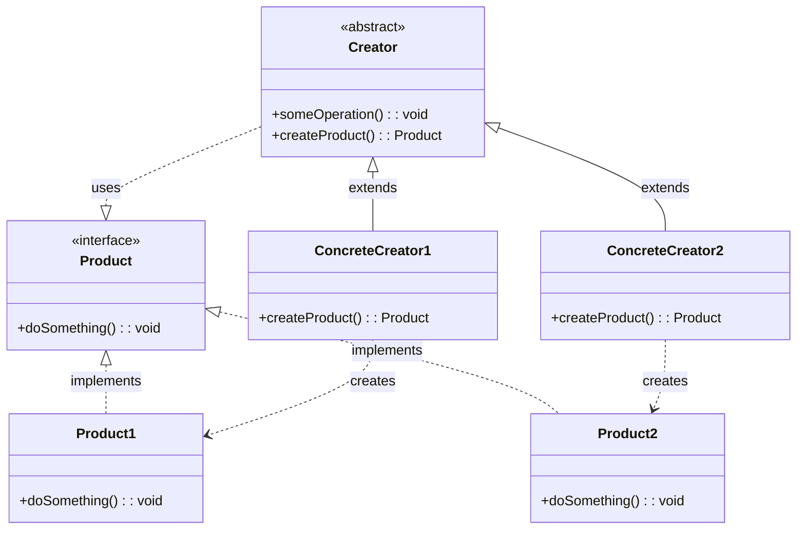

## UML Diagram

```mermaid
classDiagram
    class Product {
        <<interface>>
        +doSomething(): void
    }
    class Creator {
        <<abstract>>
        +someOperation(): void
        +createProduct(): Product
    }
    class ConcreteCreator1 {
        +createProduct(): Product
    }
    class ConcreteCreator2 {
        +createProduct(): Product
    }
    class Product1 {
        +doSomething(): void
    }
    class Product2 {
        +doSomething(): void
    }

    Creator ..|> Product : uses
    Creator <|-- ConcreteCreator1 : extends
    Creator <|-- ConcreteCreator2 : extends
    Product <|.. Product1 : implements
    Product <|.. Product2 : implements
    ConcreteCreator1 ..> Product1 : creates
    ConcreteCreator2 ..> Product2 : creates
```
